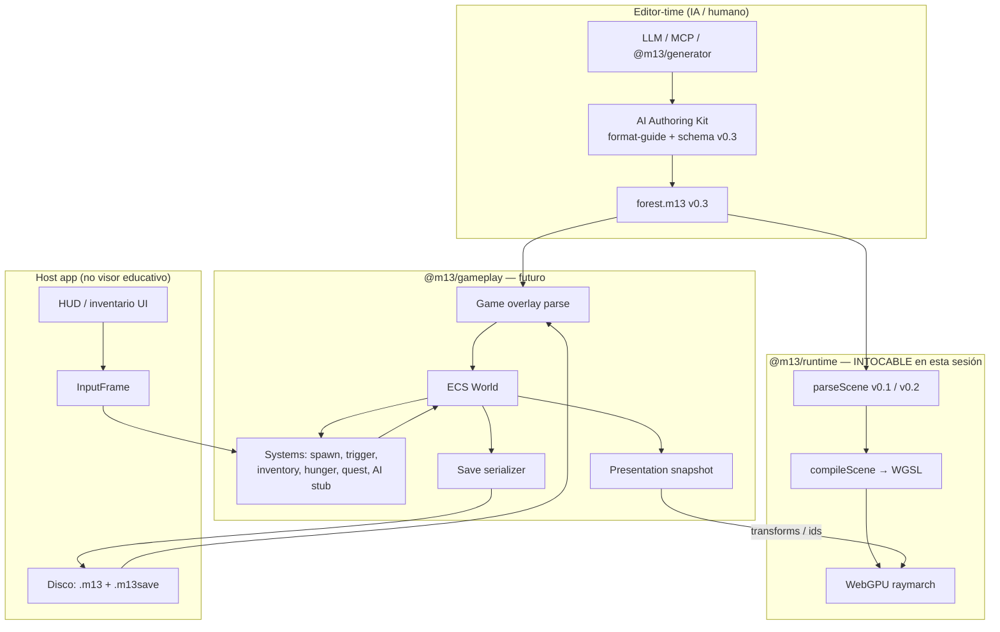

# Diagrama — arquitectura

```mermaid
flowchart TB
  subgraph authoring["Editor-time (IA / humano)"]
    LLM["LLM / MCP / @m13/generator"]
    Kit["AI Authoring Kit\nformat-guide + schema v0.3"]
    LLM --> Kit
    Kit --> M13["forest.m13 v0.3"]
  end

  subgraph host["Host app (no visor educativo)"]
    Input["InputFrame"]
    HUD["HUD / inventario UI"]
    Files["Disco: .m13 + .m13save"]
  end

  subgraph gameplay["@m13/gameplay — futuro"]
    ParseG["Game overlay parse"]
    ECS["ECS World"]
    Sys["Systems: spawn, trigger,\ninventory, hunger, quest, AI stub"]
    Pres["Presentation snapshot"]
    Save["Save serializer"]
    ParseG --> ECS
    ECS --> Sys
    Sys --> ECS
    ECS --> Pres
    ECS --> Save
  end

  subgraph visual["@m13/runtime — INTOCABLE en esta sesión"]
    ParseV["parseScene v0.1 / v0.2"]
    Comp["compileScene → WGSL"]
    GPU["WebGPU raymarch"]
    ParseV --> Comp --> GPU
  end

  M13 --> ParseG
  M13 --> ParseV
  Files --> ParseG
  Input --> Sys
  Save --> Files
  Pres -->|"transforms / ids"| GPU
  HUD --> Input
```

## Notas

- La única flecha hacia GPU es presentación, mediada por el host.
- Authoring no entra al tick.
- El sidecar `.m13save` no entra a `compileScene`.
