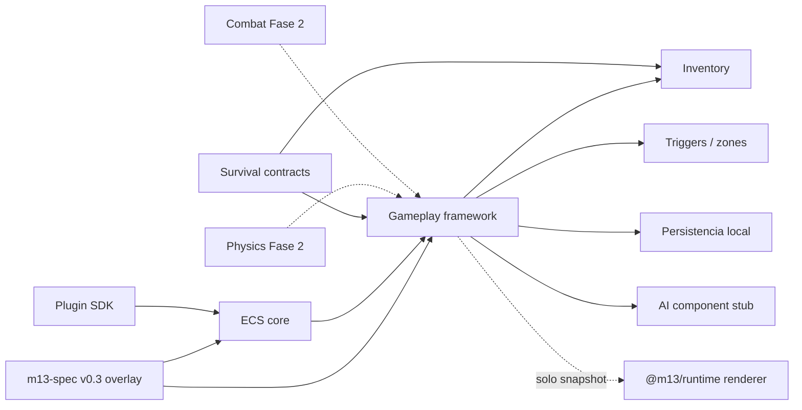

# Diagrama — dependencias de módulos

Líneas punteadas = no existen en MVP o no son dependencia de compilación.

## Orden legal de implementación (post-SDD)

1. Schema overlay + fixtures YAML  
2. ECS + tick headless  
3. Framework (player, item, zone, spawner, portal, save)  
4. Survival contracts encima  
5. Plugin SDK  
6. Integración de transforms con runtime (único PR que toca compiler, y con permiso explícito)

## Ciclos prohibidos

- `renderer → gameplay`
- `compiler → plugin de juego`
- `AI authoring → World.step`
